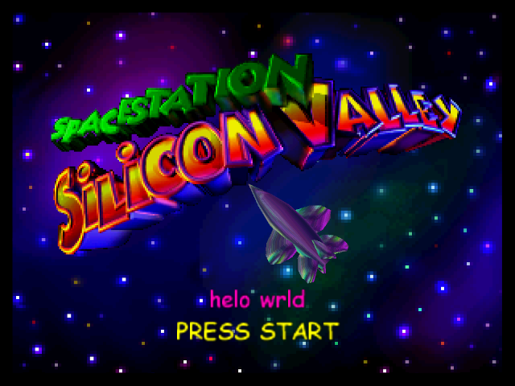

# Space Station Silicon Valley Precomp



This is a work-in-project *precomp* of Space Station Silicon Valley. It allows custom code to be injected into the ROM. Kudos to [Mr-Wiseguy](https://github.com/Mr-Wiseguy/).

# Cloning

This repo should be cloned alongside the [sssv](https://github.com/mkst/sssv) repo, e.g.

```
sssv/               ; the sssv decompilation project folder
sssv-precomp/       ; this project
```

# Building

This project works by injecting/patching code in the `.elf` that is created as part of the SSSV decompilation project. You must first build that project before compiling this one.

Once successfully compiled, the `.z64` can be found in the `build/` directory of this repo.

## Docker

**Build Docker image:**
```
docker build . -t sssv-precomp
```

**Compile:**
```
docker run --rm -ti -v $(pwd):/sssv-precomp -v $(pwd)/../sssv:/sssv sssv-precomp make
```

## Ubuntu 20.04

**NOTE:**
Assumes you have all the prerequisites required to build the `sssv` project. You can build using [gcc-mips-linux-gnu](https://packages.ubuntu.com/xenial/devel/gcc-mips-linux-gnu), or the [n64chain](https://github.com/tj90241/n64chain) specific build.

### Via mips-linux-gnu

**Install prerequisites:**
```
sudo apt-get update && apt-get install -y gcc-mips-linux-gnu
```
**Compile:**
```
CROSS=mips-linux-gnu- make
```

### Via mips-n64-gcc

**NOTE:**
Assumes you've already built the n64chain (e.g. by following CrashOveride's [instructions](https://crashoveride95.github.io/n64hbrew/modernsdk/startoff.html)).

**Compile:**
```
make
```
